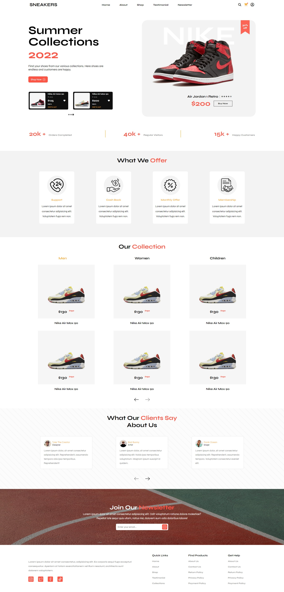

# shopping-cart (WIP)

https://ken862734801.github.io/shopping-cart/

## Preview

View on mobile

## Summary

The goal of this project is to create a full stack e-commerce site. The landing page design was taken from a design I came across on dribble, and will serve as a basis for some of the functionality I plan to implement in the future. Currently I am studying Express Routing and MongoDB. MongoDB will contain the "inventory" database. I am still unsure of which template I will use for the views/layout, I have experience with handlebars; however, pug seems to be more commonly used. 

https://dribbble.com/shots/17897500-Nike-Shoe-Store-Ecommerce-Landing-Page/attachments/13074893?mode=media

Though the actual functionality is not present there are still some functions that I have implemented that I feel are worth noting. 

### Features
- The header disappears on scroll down and reappears on scroll up.
- Splider.JS was implemented on the hero-section widget to match the functionality demonstrated on the original template design. 
- There is also simple pagination at the collection section and the testimonial section which utilized both vanilla JavaScript and jQuery. 

### Future Development
- User Auth.
- Querying "inventory" from a MongoDB database.
- Search functionality, querying the database. 
- Responsiveness at all the common breakpoints. 
- Handlebar JS or Pug for the view.
- IF TIME... redo when I learn react.... maybe... idk... 
