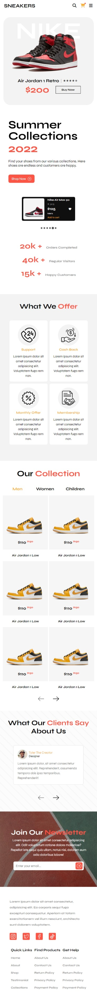

# shopping-cart

## Preview

View on mobile

## Summary

The goal of this project was to develop the front-end of an ecommerce sneaker site based on a template design I came across on dribble. 

https://dribbble.com/shots/17897500-Nike-Shoe-Store-Ecommerce-Landing-Page/attachments/13074893?mode=media

### Features
- Disappearing header on scroll down.
- Implementation of splider.js carousel functionality on the widgets.  
- Simple pagination logic. 

### Future Development

- Since I am currently learning express and mongoDB, I would like to turn this into a full stack application in the future with the inventory being stored in a database and then fetching the product details from said database through express routes.
- I also would like to add user auth in the future, as well as a searchbar functionality.
- I have to make the design more responsive at ALL the common breakpoints.